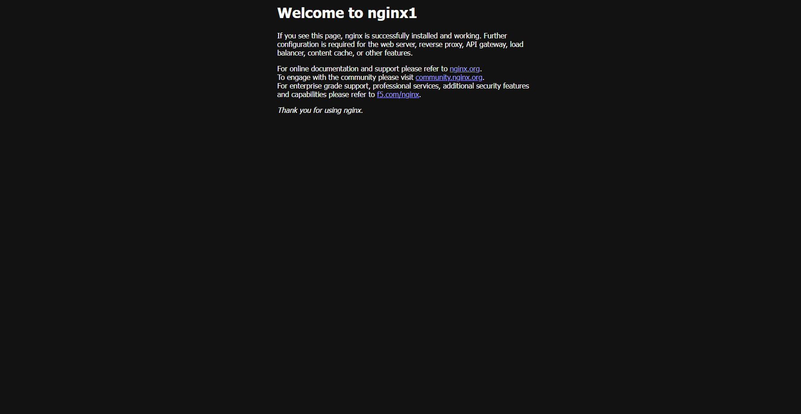
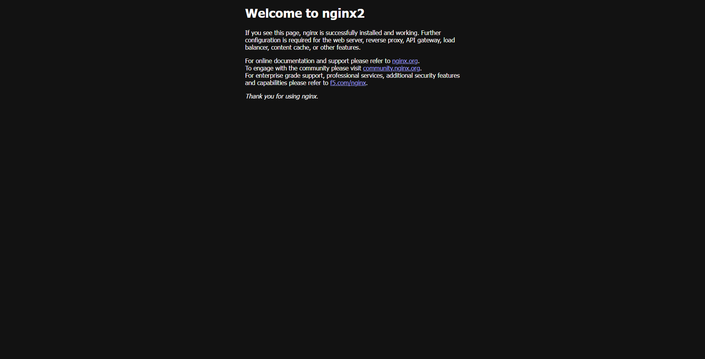
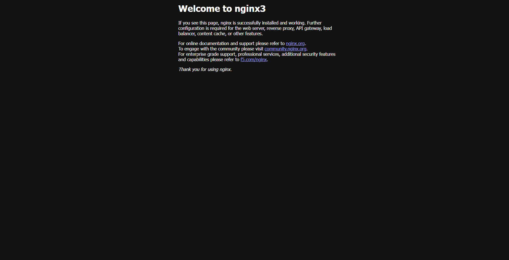
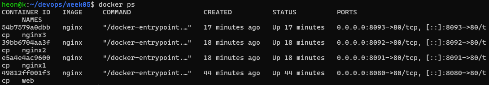

# 5주차 - Docker
## docker --version 결과
```
Docker version 29.8.1, build 4a63305
```
## docker run hello-world 실행 결과
```
Hello from Docker!
This message shows that your installation appears to be working correctly.

To generate this message, Docker took the following steps:
 1. The Docker client contacted the Docker daemon.
 2. The Docker daemon pulled the "hello-world" image from the Docker Hub.
    (amd64)
 3. The Docker daemon created a new container from that image which runs the
    executable that produces the output you are currently reading.
 4. The Docker daemon streamed that output to the Docker client, which sent it
    to your terminal.

To try something more ambitious, you can run an Ubuntu container with:
 $ docker run -it ubuntu bash

Share images, automate workflows, and more with a free Docker ID:
 https://hub.docker.com/

For more examples and ideas, visit:
 https://docs.docker.com/get-started/
```
***

## nginx 컨테이너 실행
```
docker run -d -p 8080:80 --name web nginx
```
명령어를 통해 8080:80 포트로 nginx 컨테이너 실행

## curl 응답 결과
```
HTTP/1.1 200 OK
Server: nginx/1.31.6
Date: Thu, 01 Oct 2026 03:11:15 GMT
Content-Type: text/html
Content-Length: 896
Last-Modified: Tue, 15 Sep 2026 12:54:15 GMT
Connection: keep-alive
ETag: "6aa93ff7-380"
Accept-Ranges: bytes
```
## docker ps로 실행상태 확인
```
CONTAINER ID   IMAGE     COMMAND                  CREATED         STATUS         PORTS                                     NAMES
49812ff001f3   nginx     "/docker-entrypoint.…"   6 minutes ago   Up 6 minutes   0.0.0.0:8080->80/tcp, [::]:8080->80/tcp   web
```
## 혼자서 해보기

### 3개의 다른 포트를 가진 nginx 실행
```
docker run -d -p 8091:80 --name nginx1 nginx

docker run -d -p 8092:80 --name nginx2 nginx

docker run -d -p 8093:80 --name nginx3 nginx
```
를 통해 8081, 8082, 8083 포트로 nginx 실행

### index.html 수정

```
docker exec -it nginx1 bash
sed -i 's/nginx!/nginx1/g' /usr/share/nginx/html/index.html

docker exec -it nginx2 bash
sed -i 's/nginx!/nginx2/g' /usr/share/nginx/html/index.html

docker exec -it nginx3 bash
sed -i 's/nginx!/nginx3/g' /usr/share/nginx/html/index.html
```
를 통해 nginx1 nginx2 nginx3 컨테이너들의 index.html을 수정하였음.

## 8091, 8092, 8093 curl 결과
```
8091 결과

HTTP/1.1 200 OK
Server: nginx/1.31.6
Date: Thu, 01 Oct 2026 03:33:29 GMT
Content-Type: text/html
Content-Length: 896
Last-Modified: Thu, 01 Oct 2026 03:25:27 GMT
Connection: keep-alive
ETag: "6abdd2a7-380"
Accept-Ranges: bytes
```
```
8092 결과

HTTP/1.1 200 OK
Server: nginx/1.31.6
Date: Thu, 01 Oct 2026 03:33:38 GMT
Content-Type: text/html
Content-Length: 896
Last-Modified: Thu, 01 Oct 2026 03:28:15 GMT
Connection: keep-alive
ETag: "6abdd34f-380"
Accept-Ranges: bytes
```
```
8093 결과

HTTP/1.1 200 OK
Server: nginx/1.31.6
Date: Thu, 01 Oct 2026 03:33:53 GMT
Content-Type: text/html
Content-Length: 896
Last-Modified: Thu, 01 Oct 2026 03:28:31 GMT
Connection: keep-alive
ETag: "6abdd35f-380"
Accept-Ranges: bytes
```

## index.html 스크린샷





## docker ps 스크린샷


